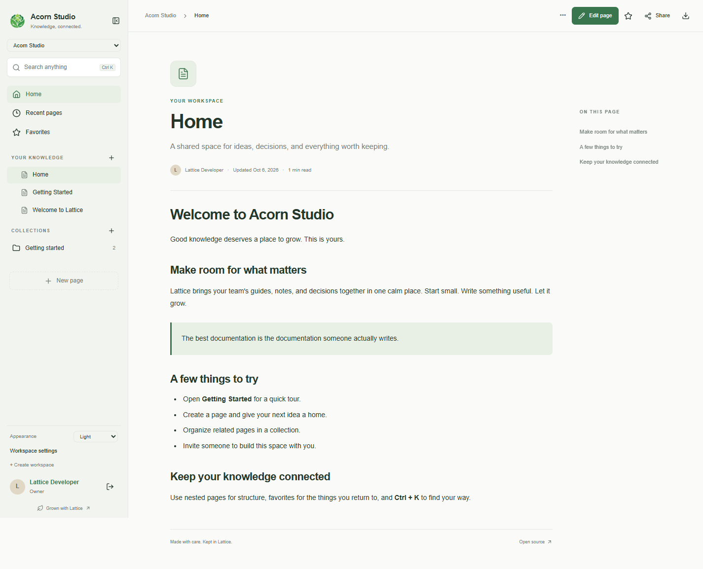
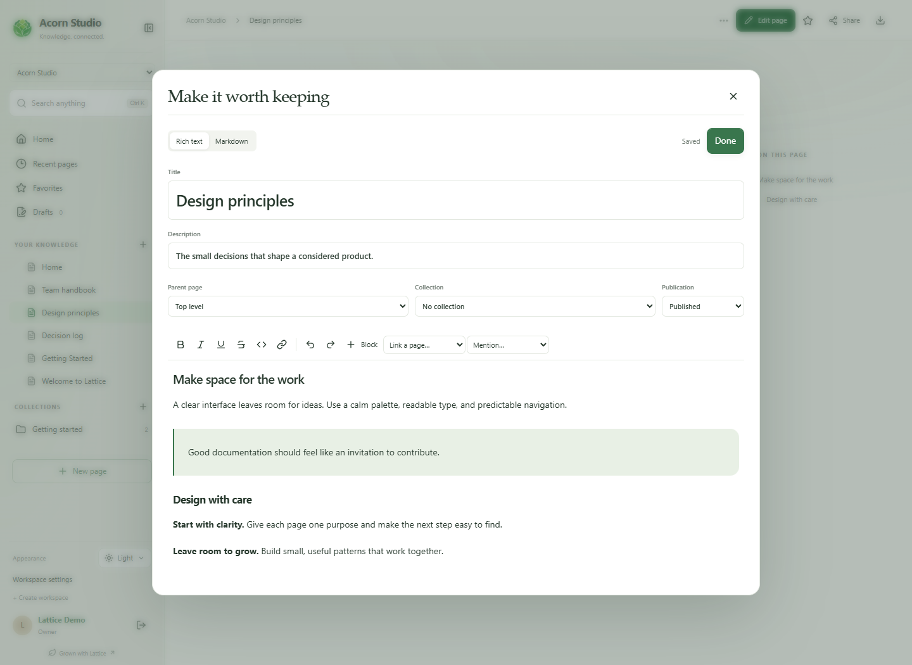
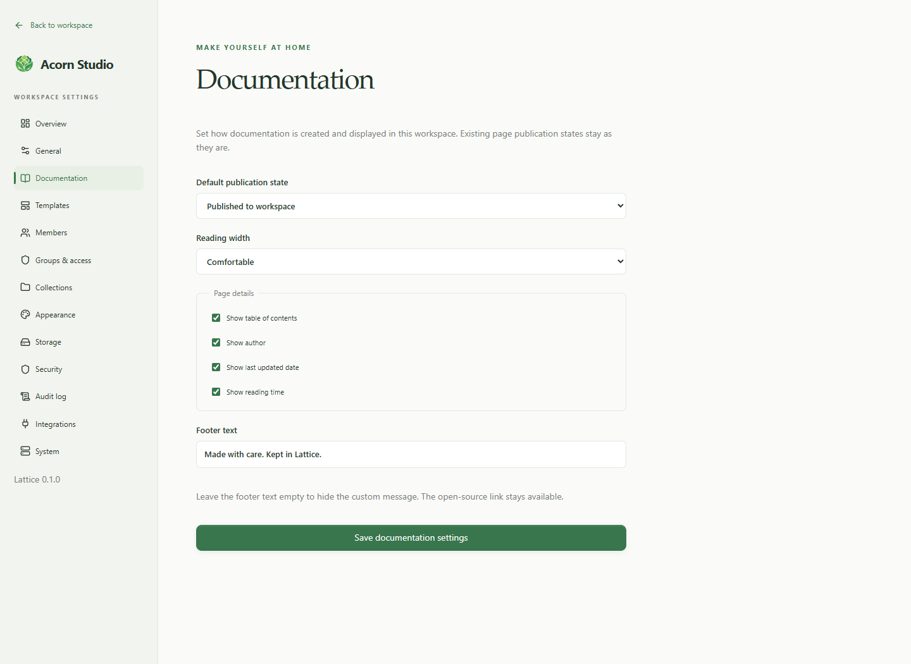
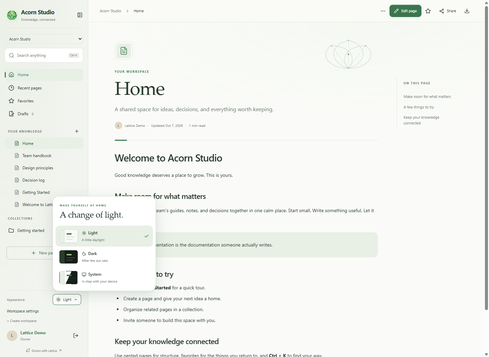

<p align="center"></p>

<h1 align="center">Lattice</h1>
<p align="center"><strong>Open knowledge, beautifully organized.</strong><br>A self-hosted wiki for the things your team wants to keep.</p>

<p align="center">
  <a href="https://github.com/valerisn/Lattice/actions/workflows/ci.yml"></a>
  <a href="https://github.com/valerisn/Lattice/actions/workflows/daemon.yml"></a>
  <a href="LICENSE"></a>
  <a href="package.json"></a>
</p>

<p align="center">
  <a href="#take-a-look">Take a look</a> ·
  <a href="#run-locally">Run locally</a> ·
  <a href="#self-host-with-docker">Self-host</a> ·
  <a href="#meet-daemon">Meet daemon</a> ·
  <a href="#documentation">Documentation</a> ·
  <a href="#contributing-and-license">Contribute</a>
</p>


Bring guides, project notes, and decisions into one connected workspace. Write in rich text or Markdown, organize pages into collections, and give people the access they need. Lattice keeps the application, database, and attachments on infrastructure you control.

> [!NOTE]
> **Early alpha, version 0.1.0.** Core workflows are functional, but expect changes before a stable release. Keep backups before upgrading. Screenshots below use an isolated sample workspace.

## Take a look

**A little less noise. A little more room to think.**

<picture>
  <source media="(prefers-color-scheme: dark)" srcset="docs/images/dark-mode.png">
  <source media="(prefers-color-scheme: light)" srcset="docs/images/workspace.png">
  
</picture>

<p align="center"><sub>Fresh captures of the current interface. The workspace preview follows your light or dark appearance.</sub></p>

<table>
  <tr>
    <td width="50%"><a href="docs/images/editor.png"></a></td>
    <td width="50%"><a href="docs/images/documentation.png"></a></td>
  </tr>
  <tr>
    <td><strong>Write in your own way.</strong><br>Rich text, Markdown, reusable templates, and saved revisions.</td>
    <td><strong>Make the workspace yours.</strong><br>Choose how documentation is created, read, and presented.</td>
  </tr>
</table>

<details>
<summary><strong>See the custom appearance picker</strong></summary>



Light, dark, and system themes, with keyboard controls and reduced-motion support.

</details>

## What you can do

|                                   | Built into Lattice                                                                                                                                                    |
| --------------------------------- | --------------------------------------------------------------------------------------------------------------------------------------------------------------------- |
| **Write something worth keeping** | Rich text and Markdown; slash commands; tables, tasks, code, images, callouts, and expandable sections; reusable templates; Markdown import/export.                   |
| **Give knowledge a home**         | Multiple workspaces, nested pages, drag reordering, collections, favorites, drafts, recent pages, incoming links, and permission-aware **Ctrl/Cmd + K** search.       |
| **Keep the context**              | Autosave, edit-conflict detection, immutable revisions, comparison, restoration, syntax highlighting, and heading navigation.                                         |
| **Share with the right people**   | Email/password accounts, invitation links, expiring sessions, profiles, four workspace roles, groups, inherited access grants, and protected attachments.             |
| **Shape your documentation**      | Branding, appearance, publication defaults, reading layouts, page metadata, footer text, a documentation overview, audit history, and an administrator version check. |
| **Run it yourself**               | Docker Compose, PostgreSQL, health checks, persistent volumes, and the optional PHP **daemon** for Linux and Windows supervision, backups, and opt-in updates.        |

Sharing copies a link; recipients still need workspace access. Mention labels do not send notifications. Drafts are visible to editors and administrators, but hidden from viewers. Anonymous publishing is not included.

[Explore the writing guide →](docs/writing.md)

## Run locally

For development or a first look. Requirements: **Node.js 24 LTS** (minimum 22), npm, and Git.

```sh
git clone https://github.com/valerisn/Lattice.git
cd Lattice
npm ci
npm run dev
```

Open [http://localhost:3000](http://localhost:3000) and create your workspace. Without `DATABASE_URL`, development uses PGlite, an embedded PostgreSQL-compatible database, in `data/dev-db`. It supports a single local development process. No shared demo account ships with Lattice.

## Self-host with Docker

For a persistent installation. Requirements: Docker Engine with **Linux containers**, Docker Compose v2, and Git. Node.js is only needed for the optional configuration helper.

```sh
git clone https://github.com/valerisn/Lattice.git
cd Lattice
node scripts/configure.mjs
docker compose up -d --build
```

The helper generates `.env` with random database and setup credentials and refuses to overwrite existing configuration. Alternatively, copy `.env.example` to `.env` and set `POSTGRES_PASSWORD` and `SETUP_TOKEN` to long random values. Use a hex database password to avoid connection-URL encoding issues.

Open [http://localhost:3000](http://localhost:3000), enter the `SETUP_TOKEN` from `.env`, and create the owner account. Setup locks after initialization. Migrations run automatically under a database lock.

For a public installation, set `APP_URL` to the exact public HTTPS origin and put a TLS reverse proxy in front of `127.0.0.1:3000`. Compose binds the app to loopback and does not publish PostgreSQL. HTTPS enables secure session cookies.

See [deployment and backups](docs/self-hosting.md).

<details>
<summary><strong>Environment variables</strong></summary>

| Variable            | Purpose                                                                                 |
| ------------------- | --------------------------------------------------------------------------------------- |
| `DATABASE_URL`      | PostgreSQL connection string. Required in production; Compose sets it.                  |
| `APP_URL`           | Exact browser-facing origin. Required in production; used for CSRF and invitation URLs. |
| `SETUP_TOKEN`       | First-run setup credential. Required for production setup.                              |
| `POSTGRES_PASSWORD` | Compose database password. Required, with no default.                                   |
| `UPLOAD_DIR`        | Attachment directory. Defaults to `./uploads`; container uses `/app/uploads`.           |
| `DATA_DIR`          | Optional development PGlite directory.                                                  |
| `PORT`              | Production listening port, default `3000`.                                              |

Keep `.env`, databases, and uploads out of Git. The supplied ignore files cover them.

</details>

<details>
<summary><strong>Develop against PostgreSQL</strong></summary>

Run `node scripts/configure.mjs`, then `docker compose -f compose.dev.yaml up -d`. Add a `DATABASE_URL` to `.env` pointing to `localhost:5432`, database/user `lattice`, and the generated password. Then run `npm run dev`.

Next.js loads `.env`. For the migration CLI, export the variables or use `node --env-file=.env --import tsx scripts/migrate.ts`. Local PGlite data does not automatically transfer into a separate PostgreSQL database.

</details>

## Meet daemon

**A quiet caretaker for your Lattice installation.**

The optional PHP supervisor watches container health, the HTTP endpoint, and free disk space. It can restart a failing app within configured limits, coordinate PostgreSQL and upload backups, and install eligible stable releases when you enable updates.

| Linux                                                 | Windows                                                         |
| ----------------------------------------------------- | --------------------------------------------------------------- |
| A systemd service with journal logs                   | A native Windows service host with rotating logs                |
| PHP 8.2+ with cURL, pcntl, and posix                  | PHP 8.2+, cURL, .NET Framework 4.8, and Windows PowerShell 5.1  |
| [Linux installation and operations](daemon/README.md) | [Windows installation and operations](daemon/windows/README.md) |

**Automatic updates are off by default.** Stopping the supervisor leaves containers running. Interrupted updates block further automated recovery until an operator reviews the installation.

Windows CI exercises the real service lifecycle using a fixture Docker executable. Full Windows Docker Desktop integration remains unverified. Linux CI exercises real containers and PostgreSQL/upload backups.

## Documentation

| Start here                                | What you'll find                                        |
| ----------------------------------------- | ------------------------------------------------------- |
| [Writing and organizing](docs/writing.md) | Editing, templates, imports, and page organization      |
| [Self-hosting](docs/self-hosting.md)      | Configuration, deployment, upgrades, and recovery       |
| [Architecture](docs/architecture.md)      | Application structure, data model, and permission rules |
| [Internal API](docs/api.md)               | The application's internal endpoints                    |
| [Security](SECURITY.md)                   | Security boundaries, known limits, and reporting issues |
| [Contributing](CONTRIBUTING.md)           | Local development and contribution guidance             |

## Development and checks

```sh
npm run check
npm run build
npx playwright install chromium
npm run test:e2e
```

`check` runs ESLint, TypeScript, and service/security tests. Stop any running dev server before browser tests. Without `DATABASE_URL`, browser tests use fresh `data/e2e-*` directories. With `DATABASE_URL`, they use the production build and expect a **fresh, disposable PostgreSQL database**. Never point tests at your real installation. CI also builds and starts the Docker stack.

## Architecture

Next.js App Router, React, strict TypeScript, PostgreSQL, and TipTap. Services use parameterized SQL, transactions, and versioned migrations. Explicit SQL keeps the schema compatible with both PostgreSQL and the local PGlite adapter. Search and storage have replaceable provider interfaces.

See [architecture and permission rules](docs/architecture.md) and [the internal API](docs/api.md).

## Current limits and planned work

- OAuth/SSO, LDAP/SAML, email delivery, and password-reset email
- Realtime collaboration, notifications, webhooks, and a plugin SDK
- S3 storage, external search indexes, background jobs, and pagination
- Anonymous publishing, public API tokens, rich media embeds, custom favicons, and richer audit logs
- The first release loads workspace pages for navigation/search; large installations need indexing and query tuning
- History shows the latest 100 revisions while the database retains all revisions; large comparisons fall back to side-by-side text
- Page deletion removes history and may leave orphaned attachment files; a file cleanup tool is planned

Planned integrations are clearly identified as unavailable in the interface.

## Contributing and license

Build something useful with us. Start with [CONTRIBUTING.md](CONTRIBUTING.md), browse [open issues](https://github.com/valerisn/Lattice/issues), or follow [SECURITY.md](SECURITY.md) to report a vulnerability.

Copyright © 2026 Lattice contributors. Licensed under **GNU Affero General Public License v3.0 only**. See [LICENSE](LICENSE). Network users of a modified version must have access to its corresponding source under the license's terms.

<p align="center"><sub>Made with care. Kept in Lattice.</sub></p>
